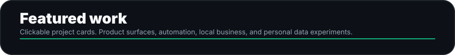
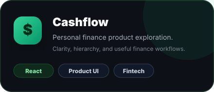
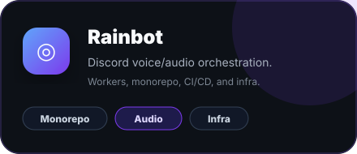
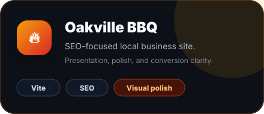
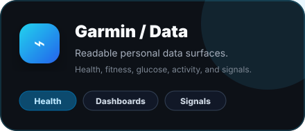
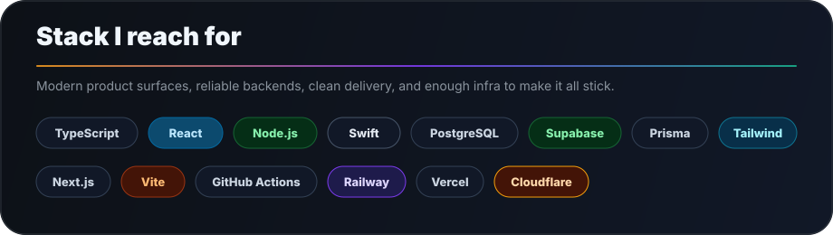

  

  <a href="https://github.com/Connor-Adams/cashflow">Cashflow</a> ·
  <a href="https://github.com/Connor-Adams/rainbot">Rainbot</a> ·
  <a href="https://github.com/Connor-Adams/OkavilleBBQ-site">Oakville BBQ</a> ·
  <a href="https://github.com/Connor-Adams/garmin">Garmin/Data</a>

  

  I work close to the product, find the real failure mode, and build systems that prevent the same problem from coming back.
   
  I care about hierarchy, spacing, interaction polish, data clarity, and whether the thing actually feels good to use.

  

  

<table>
  <tr>
    <td width="50%" valign="top" align="center">
      
    </td>
    <td width="50%" valign="top" align="center">
      
    </td>
  </tr>
  <tr>
    <td width="50%" valign="top" align="center">
      
    </td>
    <td width="50%" valign="top" align="center">
      
    </td>
  </tr>
</table>

  

  

  

  

