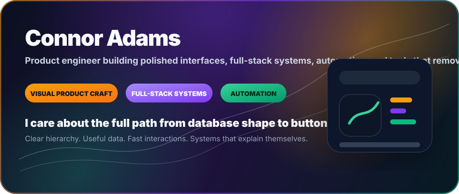
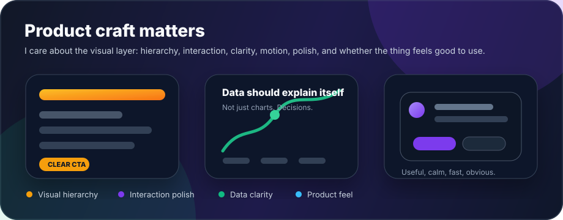
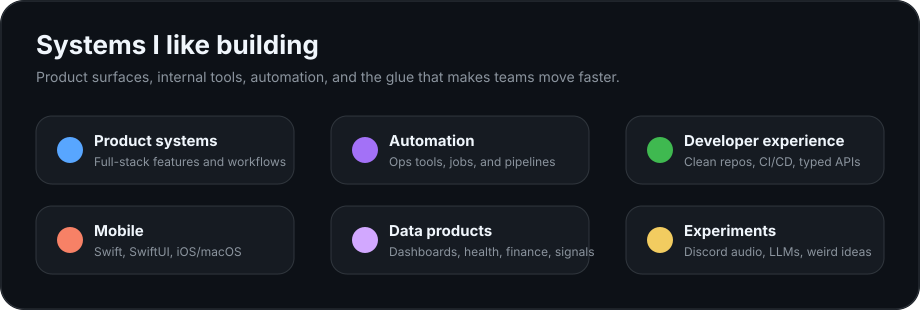
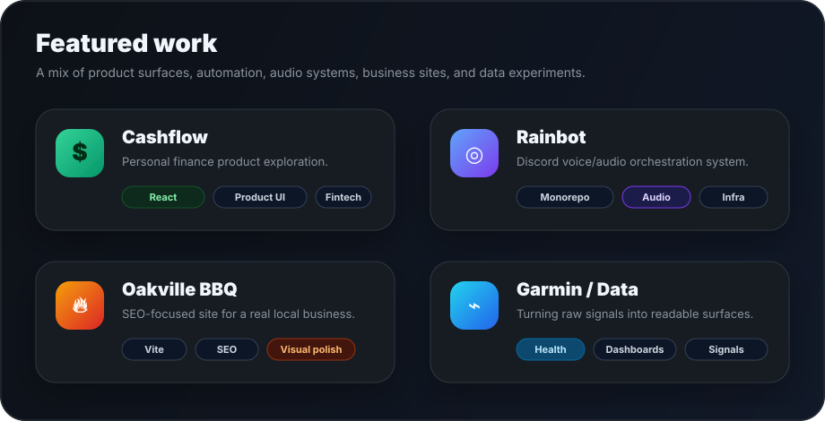
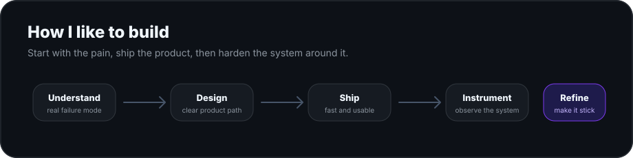
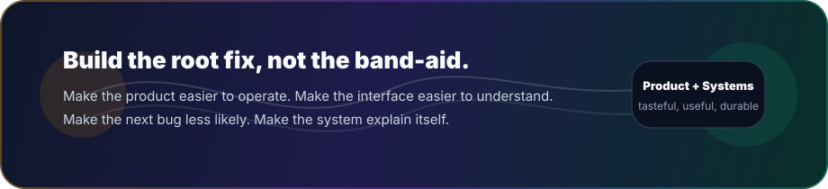

  

  <a href="https://github.com/Connor-Adams/cashflow">Cashflow</a> ·
  <a href="https://github.com/Connor-Adams/rainbot">Rainbot</a> ·
  <a href="https://github.com/Connor-Adams/OkavilleBBQ-site">Oakville BBQ</a> ·
  <a href="https://github.com/Connor-Adams/garmin">Garmin/Data</a>

  
  
  
  

  

---

  I work close to the product, find the real failure mode, and build the system that prevents the same problem from coming back.

  I put a strong emphasis on the visual layer of a product: hierarchy, spacing, interaction polish, data clarity, and whether the thing actually feels good to use.

  

## Core lanes

  
  
  
  
  
  

## Featured work

  

  <a href="https://github.com/Connor-Adams/cashflow"><strong>Cashflow</strong></a> ·
  <a href="https://github.com/Connor-Adams/rainbot"><strong>Rainbot</strong></a> ·
  <a href="https://github.com/Connor-Adams/OkavilleBBQ-site"><strong>Oakville BBQ</strong></a> ·
  <a href="https://github.com/Connor-Adams/garmin"><strong>Garmin/Data</strong></a>

## Build loop

  

## Stack

  

  TypeScript · React · Node.js · Swift · SwiftUI · PostgreSQL · Supabase · Prisma · Tailwind · Next.js · Vite · GitHub Actions · Railway · Vercel · Cloudflare

## Activity

  

## Current interests

  Product engineering with high ownership · Polished interfaces · AI-assisted internal tooling · Personal finance systems · Health/data visualization · Developer experience · Clean infrastructure

  

